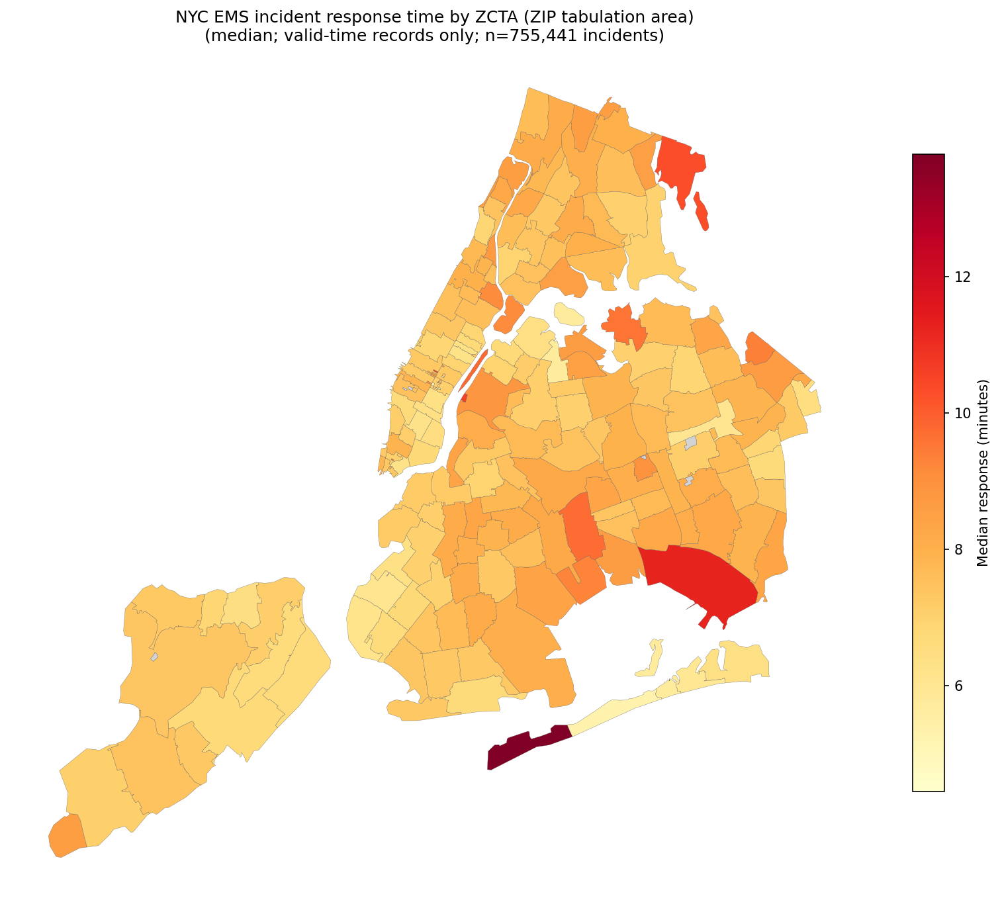

# EMS data analysis

- API endpoint: https://data.cityofnewyork.us/resource/76xm-jjuj.json
- OpenAPI documentation: https://dev.socrata.com/foundry/data.cityofnewyork.us/76xm-jjuj
- Codebook: [ems_codebook.json](ems_codebook.json)
- NYC shapefile: https://data.mixi.nyc/nyc-zip-codes.geojson

## Get the Data into a local SQLite database

``` bash
# Full load (expect a long wait)
uv run fetch_ems_to_sqlite.py
```

Database is located at ems_incidents.sqlite.

## Heat map of response times

``` bash
uv run heatmap_response_times.py -o time_by_zip.png
```

