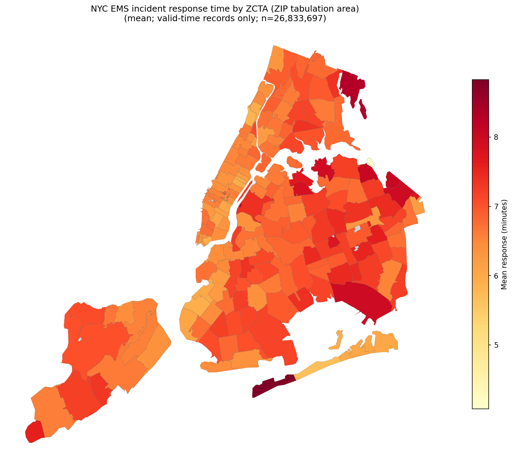

# EMS data analysis

- API endpoint: https://data.cityofnewyork.us/resource/76xm-jjuj.json
- OpenAPI documentation: https://dev.socrata.com/foundry/data.cityofnewyork.us/76xm-jjuj
- Codebook: [ems_codebook.json](ems_codebook.json)
- NYC shapefile: https://data.mixi.nyc/nyc-zip-codes.geojson

## Get the Data into a local SQLite database

``` bash
# Full load (expect a long wait)
uv run fetch_ems_to_sqlite.py
```

Database is located at ems_incidents.sqlite.

## Heat map of response times

With default options (full NYC choropleth, not `--by-year`, not `--include-pin`), the PNG is written **directly in `maps/`**—not under `by-year`, `by-zip`, or `by-pin`. Other modes use those subfolders.

| Mode | Default path |
|------|----------------|
| Full city, default flags (ZCTA) | `maps/ems_response_time_by_zipcode.png` |
| Full city, `--geo school_district` | `maps/ems_response_time_by_school_district.png` |
| `--by-year` | `maps/by-year/{year}.png` (e.g. `2024.png`) |
| `--include-pin` | `maps/by-pin/{slug}.png` from `--label` (e.g. Randalls Island → `randalls_island.png`; empty label → `pin.png`) |

``` bash
# Default: writes maps/ems_response_time_by_zipcode.png
uv run render_heatmap.py

# Override output path
uv run render_heatmap.py -o time_by_zip.png

# One map per year (shared color scale)
uv run render_heatmap.py --by-year
```



## Single ZIP: heatmap frame and Google Static Map

`render_single_zip.py` draws one ZCTA in Web Mercator (matplotlib and/or Google). Defaults:

- Heatmap: `maps/by-zip/{zip}_heatmap.png`
- Google: `maps/by-zip/{zip}_google.png`

Requires `GOOGLE_MAPS_API_KEY` in the environment for `--mode google` or `both`.

``` bash
uv run render_single_zip.py 10035
```
